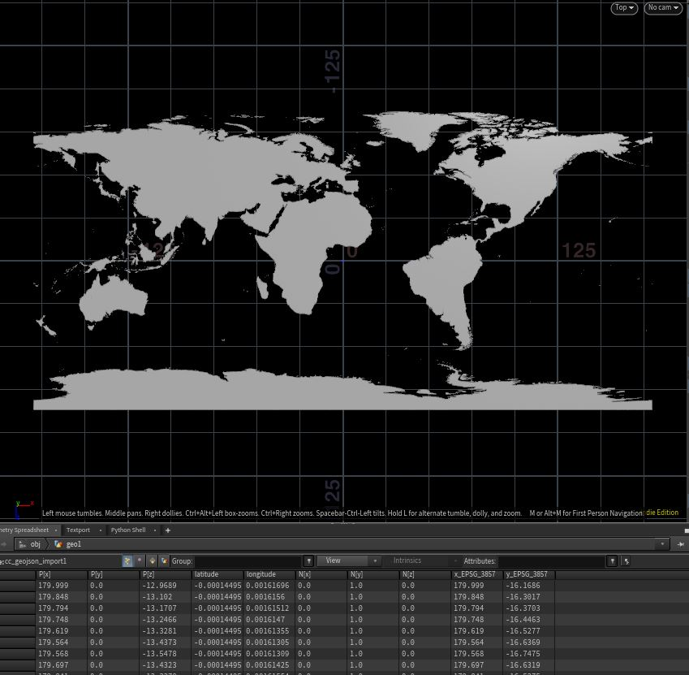
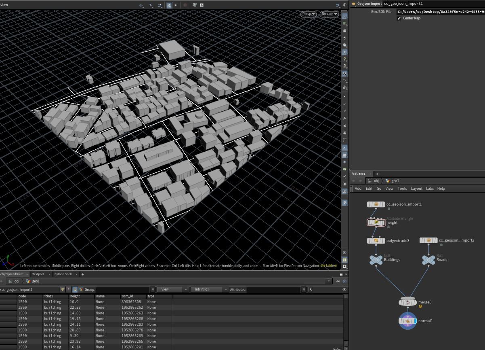

# Houdini GeoJSON Importer
###### Houdini GeoJSON Importer Digital Asset. Parses geojson files and converts them into Houdini geometry.

###### Supported Geometries
- Point
- LineString
- Polygon
- MultiPoint
- MultiLineString
- MultiPolygon
- GeometryCollection

